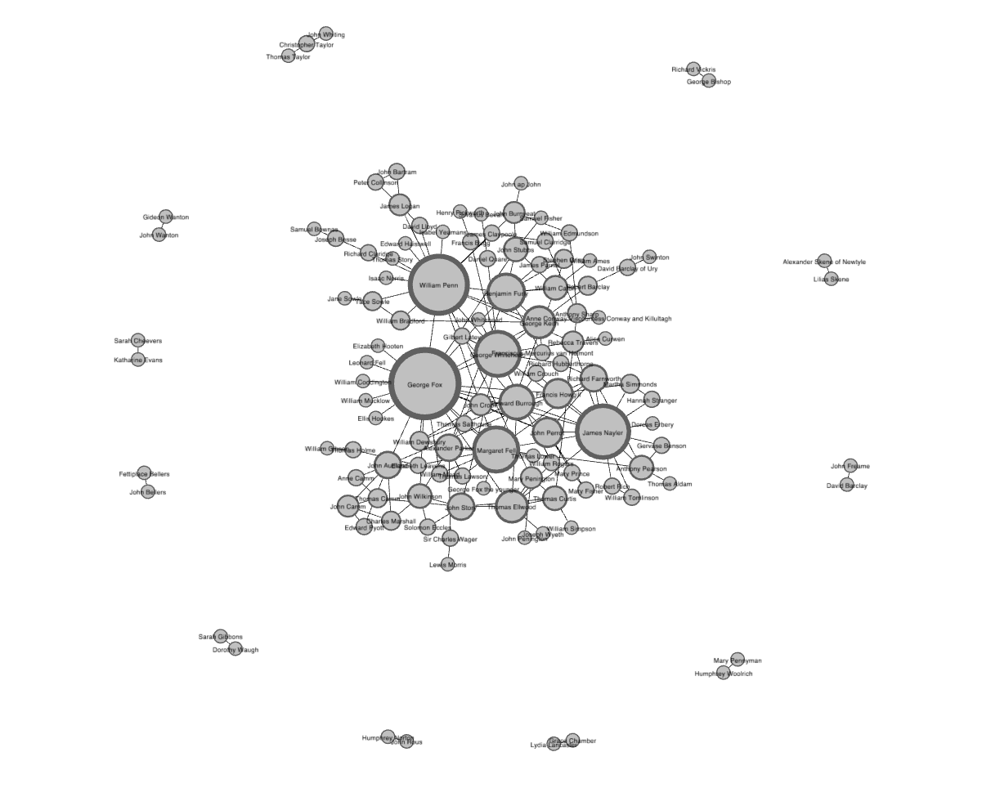

# Exploring and Analyzing Network Data with Python
Tutorial for exploring network statistics and metrics

This project is a walk through of the lesson, with the same name, from the website [Programming Historian](https://programminghistorian.org/en/lessons/exploring-and-analyzing-network-data-with-python). Published by *John R. Ladd, Jessica Otis, Christopher N. Warren, and Scott Weingart*, it introduces network metrics and how to draw conclusions from them when working with humanities data. It also teaches you how to use the NetworkX Python package to produce and work with these network statistics.

## Goals
- To use the NetworkX package for working with network data in Python; and
- To analyse humanities network data to find:
  - Network structure and path lengths,
  - Important or central nodes, and
  - Communities and subgroups